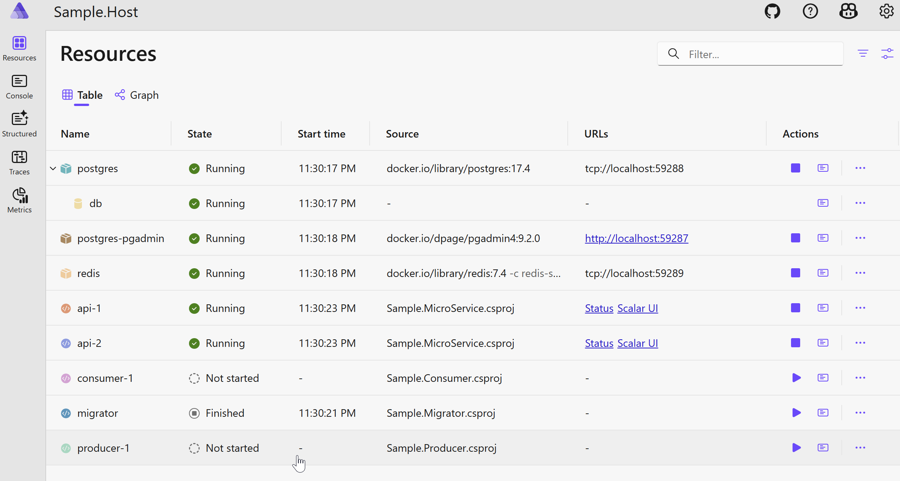
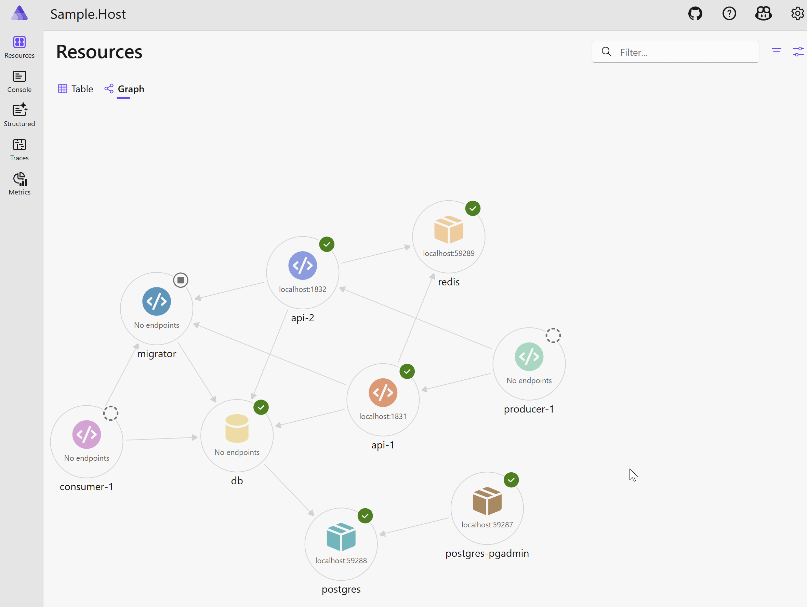
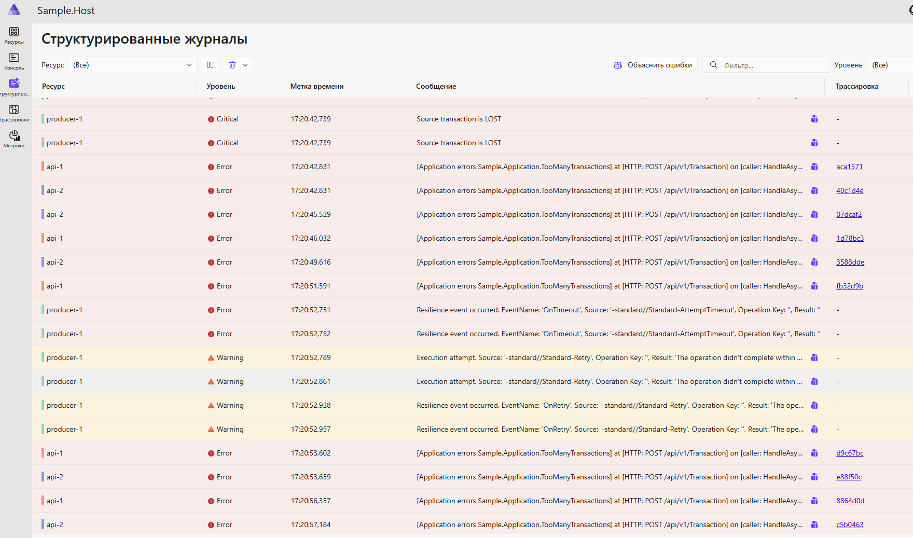

# Aspire.Sample

Transaction producer sends them to api.
Consumer consumer from db.

## Prerequisites

1. VisualStudio CE
2. .NET9
3. .NET Aspire
4. Docker Desktop (on windows)
5. Insomnia (optional)

# Application resources 

## List view

## Graph view

## Solution Structure and Init 

# Instruction

1. Run Docker Desktop
2. Run Solution from VS
3. See Aspire Dashboard in browser
4. Run producer by hands
5. Await TooManyTransactions in Structured Logs by Api service
6. Run Consumer by hands

## Structured Logs (producer started)

## Insomnia
